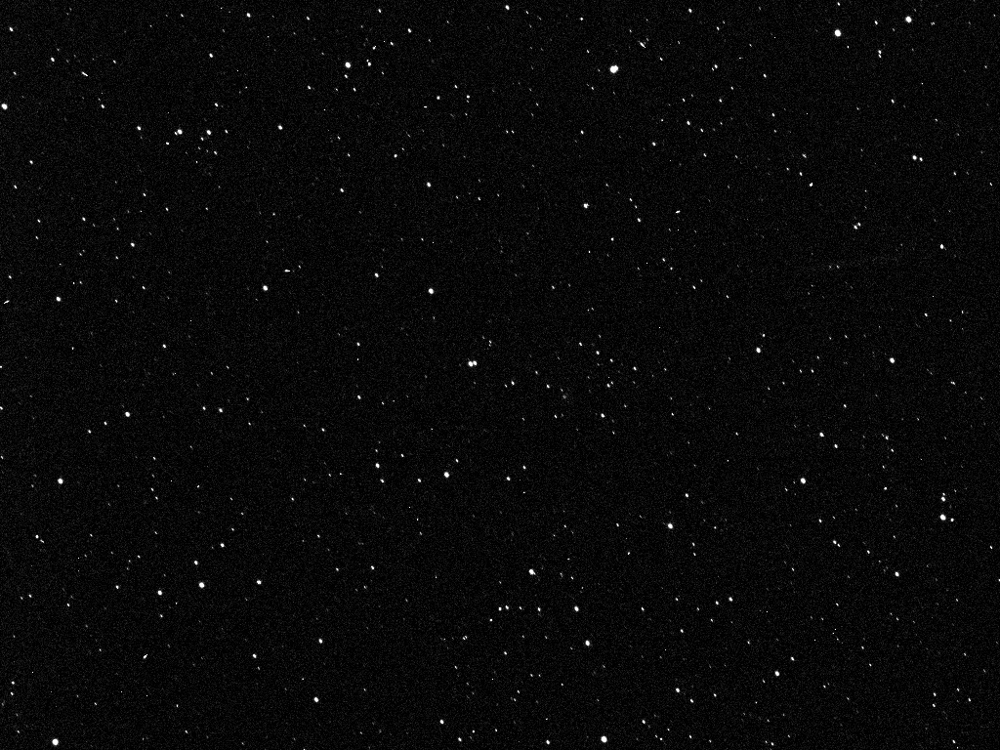
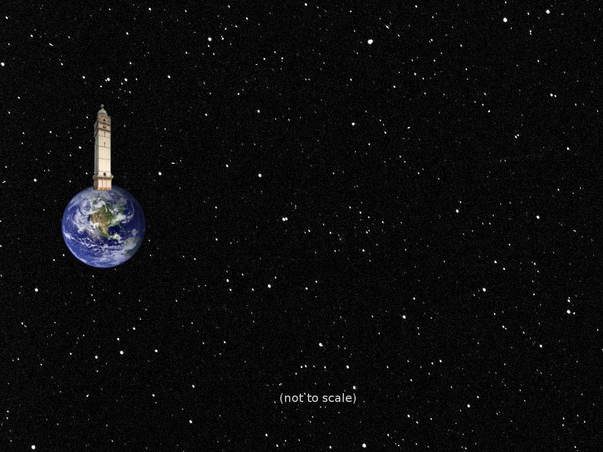
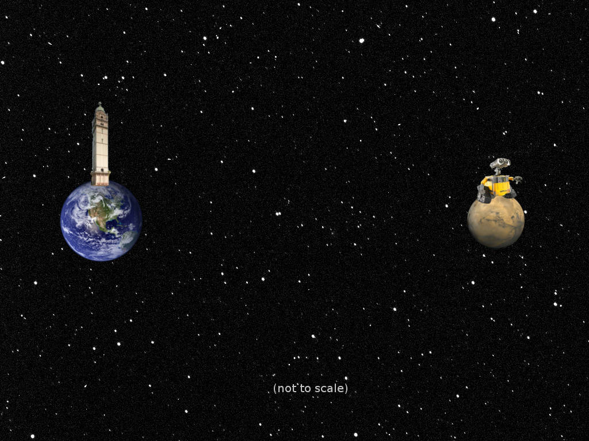
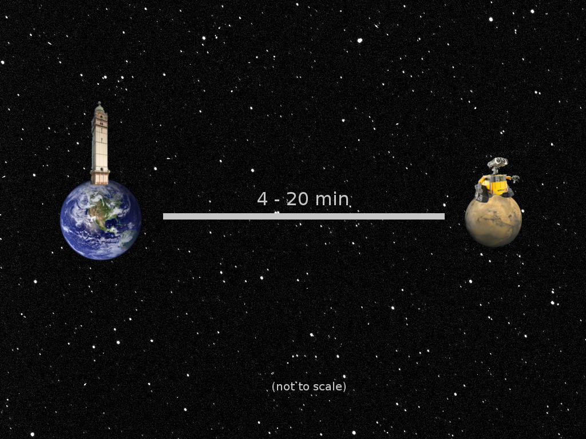
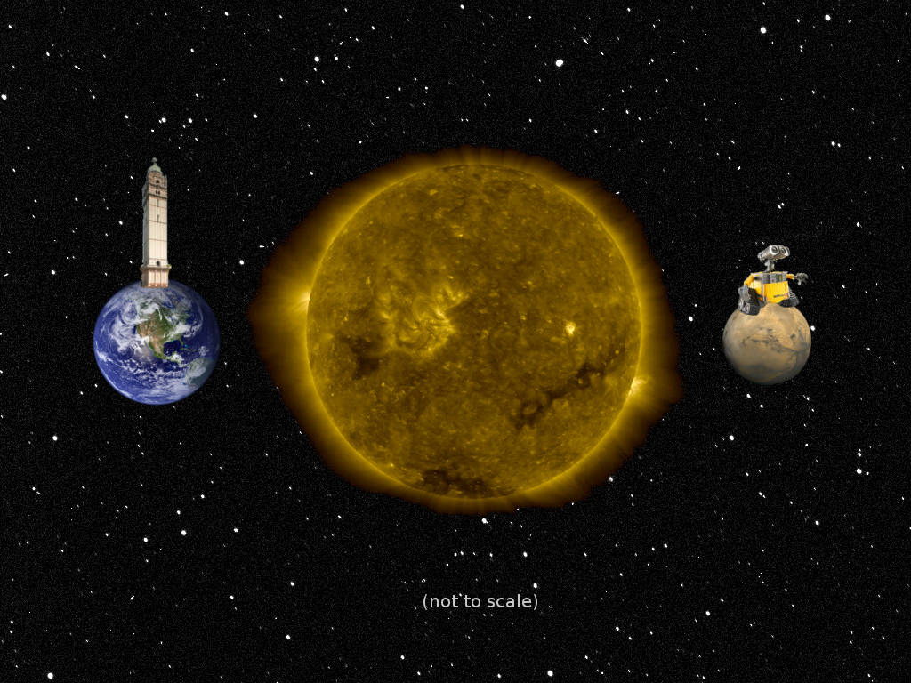

#

\begin{center}
  \textsc{\LARGE LTc}\\[0.5cm]
  \textsc{\large A replicated data store for high-latency disconnected environments}
\end{center}

#

#

#

#

#

\begin{center}
  \Large Problem 1: High latency
\end{center}

#

#

#

\begin{center}
  \Large Problem 2: Intermittent connectivity
\end{center}

#

\begin{center}
  \large (smaller) \Large Problem 3: Lossy channels
\end{center}

# Three Problems

* Problem 1: High latency

* Problem 2: Intermittent connectivity

* Problem 3: Lossy channels

# Data replication

\tikzset{state/.style={rectangle, draw, text centered}}

\centering

\begin{tikzpicture}

\node (A1) {Node 1};
\node (A2) [state, below of=A1] {A, B};
\node (A3) [state, below=1.4cm of A2] {\dots};
\node (A4) [state, below=1.4cm of A3] {A, B, C};

\node (B1) [right=2cm of A1] {Node 2};
\node (B2) [state, below of=B1] {A, C};
\node (B3) [state, below=1.4cm of B2] {\dots};
\node (B4) [state, below=1.4cm of B3] {A, B, C};

\path[->]
    (A2) edge (A3)
    (A3) edge (A4)
    (B2) edge (B3)
    (B3) edge (B4);

\path[->,dashed,font=\scriptsize]
    (A2) edge (B3)
    (B2) edge (A3)
    (B3) edge (A4)
    (A3) edge (B4);

\end{tikzpicture}

# Clustering

\tikzset{state/.style={rectangle, draw, text centered}}

\centering

\begin{tikzpicture}

\node (A1) {Node 1};
\node (A2) [state, below of=A1] {A};
\node (A3) [state, below=0.6cm of A2] {A};
\node (A4) [state, below=0.6cm of A3] {A};
\node (A5) [state, below=0.6cm of A4] {A};
\node (A6) [state, below=0.6cm of A5] {A, B};

\node (B1) [right=2cm of A1] {Node 2};
\node (B2) [state, below of=B1] {A};
\node (B3) [state, below=0.6cm of B2] {A};
\node (B4) [state, below=0.6cm of B3] {A};
\node (B5) [state, below=0.6cm of B4] {A, B};
\node (B6) [state, below=0.6cm of B5] {A, B};

\path[->]
    (A2) edge (A3)
    (A3) edge (A4)
    (A4) edge (A5)
    (A5) edge (A6)
    (B2) edge (B3)
    (B3) edge (B4)
    (B4) edge (B5)
    (B5) edge (B6);

\path[->,dashed,font=\scriptsize]
    (A2) edge node [above] {B?} (B3)
    (B3) edge node [above] {B? ok} (A4)
    (A4) edge node [above] {B!} (B5)
    (B5) edge node [above] {B! ok} (A6);

\end{tikzpicture}

# Master-slave replication

\tikzset{state/.style={rectangle, draw, text centered}}

\centering

\begin{tikzpicture}

\node (A1) {Node 1};
\node (A2) [state, below of=A1] {A B};
\node (A3) [state, below=0.6cm of A2] {A B C};
\node (A4) [state, below=0.6cm of A3] {A B C D};
\node (A5) [state, below=0.6cm of A4] {A B C D E};
\node (A6) [state, below=0.6cm of A5] {A B C D E};

\node (B1) [right=2cm of A1] {Node 2};
\node (B2) [state, below of=B1] {A};
\node (B3) [state, below=0.6cm of B2] {A B};
\node (B4) [state, below=0.6cm of B3] {A B C};
\node (B5) [state, below=0.6cm of B4] {A B C};
\node (B6) [state, below=0.6cm of B5] {A B C D E};

\path[->]
    (A2) edge (A3)
    (A3) edge (A4)
    (A4) edge (A5)
    (A5) edge (A6)
    (B2) edge (B3)
    (B3) edge (B4)
    (B4) edge (B5)
    (B5) edge (B6);

\path[->,dashed,font=\scriptsize]
    (A2) edge node [above] {B} (B3)
    (A3) edge node [above] {C} (B4)
    (A5) edge node [above] {D E} (B6);

\end{tikzpicture}

# Master-master replication?

\tikzset{state/.style={rectangle, draw, text centered}}

\centering

\begin{tikzpicture}

\node (A1) {Node 1};
\node (A2) [state, below of=A1] {A, B};
\node (A3) [state, below=1.4cm of A2] {A, B};
\node (A4) [state, below=1.4cm of A3] {A, B};

\node (B1) [right=2cm of A1] {Node 2};
\node (B2) [state, below of=B1] {A, $\lnot$ B};
\node (B3) [state, below=1.4cm of B2] {A, $\lnot$ B};
\node (B4) [state, below=1.4cm of B3] {A, $\lnot$ B};

\path[->]
    (A2) edge (A3)
    (A3) edge (A4)
    (B2) edge (B3)
    (B3) edge (B4);

\path[->,dashed,font=\scriptsize]
    (A2) edge node [right] {B} (B3)
    (B2) edge node [left] {$\lnot$ B} (A3)
    (B3) edge node [left] {$\lnot$ B} (A4)
    (A3) edge node [right] {B} (B4);

\end{tikzpicture}

# Introducing LTc

\centering

\begin{tikzpicture}

\node (A1) [text width=2cm, text centered] {Application};
\node (A2) [below of=A1, text width=1cm, xshift=1cm, align=flush right] {LTc};

\node (B1) [right=2cm of A1, text width=2cm, text centered] {Application};
\node (B2) [below of=B1, text width=1cm, xshift=1cm, align=flush left] {LTc};

\draw[thick] ($(A1.north west)+(-0.5,0.15)$) rectangle ($(A2.south east)+(0.5,-0.15)$);
\draw[thick, dotted] ($(A2.north west)+(-0.5,0.15)$) rectangle ($(A2.south east)+(0.5,-0.15)$);
\draw[thick] ($(B1.north west)+(-0.5,0.15)$) rectangle ($(B2.south east)+(0.5,-0.15)$);
\draw[thick, dotted] ($(B2.north west)+(-0.5,0.15)$) rectangle ($(B2.south east)+(0.5,-0.15)$);

\draw[<->] (A2.south) -- ++(0,-1) -| (B2.south);
\node (label) [below of=A2, yshift=-0.6cm, xshift=2cm] {Auto sync};

\end{tikzpicture}

# What we know

\tikzset{state/.style={rectangle, draw, text centered}}

\centering

\begin{tikzpicture}

\node (A1) {Other data stores};
\node (A2) [state, below of=A1] {\dots};
\node (A3) [state, below=1cm of A2] {\dots};
\node (A4) [state, below=1cm of A3] {\dots};

\node (B1) [right=2cm of A1] {LTc};
\node (B2) [state, below of=B1] {\dots};
\node (B3) [state, below=1cm of B2] {\dots};
\node (B4) [state, below=1cm of B3] {\dots};

\path[->]
    (A2) edge (A3)
    (A3) edge (A4)
    (B2) edge (B3)
    (B3) edge (B4);

\draw[thick,dotted] ($(A4.north west)+(-0.5,0.15)$) rectangle ($(A4.south east)+(0.5,-0.15)$);
\draw[thick,dotted] ($(B2.north west)+(-0.5,0.15)$) rectangle ($(B4.south east)+(0.5,-0.15)$);

\end{tikzpicture}

# Key-value store

\tikzset{state/.style={rectangle, draw, text centered}}

\centering

\begin{tikzpicture}

\node (B1) [right=2cm of A1] {\texttt{[(Key, Value)]}};
\node (B2) [state, below of=B1] {\texttt{[("foo", 23)]}};
\node (B3) [state, below=1cm of B2] {\texttt{[("foo", 23),("bar", 41)]}};
\node (B4) [state, below=1cm of B3] {\texttt{[("foo", 23),("bar", 42)]}};

\path[->]
    (B2) edge (B3)
    (B3) edge (B4);

\end{tikzpicture}

# Changes

\tikzset{state/.style={rectangle, draw, text centered}}

\centering

\begin{tikzpicture}

\node (B1) [right=2cm of A1] {\texttt{[(Key, Value)]}};
\node (B2) [state, below of=B1] {\texttt{[("foo", 23)]}};
\node (B3) [state, below=1cm of B2] {\texttt{[("foo", 23),("bar", 41)]}};
\node (B4) [state, below=1cm of B3] {\texttt{[("foo", 23),("bar", 42)]}};

\path[->]
    (B2) edge node [right] {\texttt{[("bar", +41)]}} (B3)
    (B3) edge node [right] {\texttt{[("bar", +1)]}} (B4);

\end{tikzpicture}

# Handling updates --- the setup

\tikzset{state/.style={rectangle, draw, text centered}}

\centering

\begin{tikzpicture}

\node (A1) {Node 1};
\node (A2) [state, below of=A1] {\texttt{[("foo", 23)]}};
\node (A3) [state, below=1cm of A2] {\texttt{[("foo", 24)]}};

\node (B1) [right=4cm of A1] {Node 2};
\node (B2) [state, below of=B1] {\texttt{[("foo", 23)]}};
\node (B3) [below=1cm of B2] {};
\node (B4) [below=1cm of B3] {};

\path[->]
    (A2) edge node [right] {\texttt{[("foo", +1)]}} (A3)
    (B2) edge (B3);

\path[->,dashed,font=\scriptsize]
    (A3) edge node [below, xshift=-0.5cm] {\texttt{[("foo", +1)]}} (B4);

\end{tikzpicture}

# Handling updates --- the simple case

\tikzset{state/.style={rectangle, draw, text centered}}

\centering

\begin{tikzpicture}

\node (A1) {Node 1};
\node (A2) [state, below of=A1] {\texttt{[("foo", 23)]}};

\node (B1) [right=4cm of A1] {Node 2};
\node (B2) [state, below of=B1] {\texttt{[("foo", 23)]}};
\node (B3) [state, below=1cm of B2] {\texttt{[("foo", 24)]}};

\path[->]
    (B2) edge (B3);

\path[->,dashed,font=\scriptsize]
    (A2) edge node [below, xshift=-0.6cm] {\texttt{[("foo", +1)]}} (B3);

\end{tikzpicture}

# Handling updates --- the merge

\tikzset{state/.style={rectangle, draw, text centered}}

\centering

\begin{tikzpicture}

\node (A1) {Node 1};
\node (A2) [state, below of=A1] {\texttt{[("foo", 23)]}};

\node (B1) [right=4cm of A1] {Node 2};
\node (B2) [state, below of=B1] {\texttt{[("foo", 23)]}};
\node (B3) [state, below=1cm of B2, xshift=2cm] {\texttt{[("foo", 25)]}};
\node (B4) [state, below=1cm of B2, xshift=-2cm] {\texttt{[("foo", 24)]}};
\node (B5) [state, below=3cm of B2] {\texttt{["foo", 26]}};

\path[->]
    (B2) edge (B4)
    (B2) edge node [right] {\texttt{[("foo", +2)]}} (B3)
    (B2) edge node [right, yshift=-0.75cm] {\texttt{[("foo", +3)]}} (B5);

\path[->,dashed,font=\scriptsize]
    (B3) edge (B5)
    (B4) edge (B5);

\path[->,dashed,font=\scriptsize]
    (A2) edge node [below, xshift=-0.8cm] {\texttt{[("foo", +1)]}} (B4);

\end{tikzpicture}

# Propagating updates --- what to send

\tikzset{state/.style={rectangle, draw, text centered}}

\centering

\begin{tikzpicture}

\node (A1) {Node 1};
\node (A2) [state, below of=A1] {\texttt{[("foo", 23)]}};
\node (A3) [state, below=1cm of A2] {\texttt{[("foo", 24)]}};

\node (B1) [right=4cm of A1] {Node 2};
\node (B2) [state, below of=B1] {?};

\path[->]
    (A2) edge node [right] {\texttt{[("foo", +1)]}} (A3);
\end{tikzpicture}

# Recap

* Key-value store

* Versioned data

* Automatic master-master replication

* Merge-based conflict resolution

* Simple strongly-typed interface

# Distributed auction house --- LTc setup

~~~~ {.haskell}
store <- open (def { location = "auction-store"
                   , nodeName = myUniqueName
                   })
node <- Node.serve store myUniqueName
Node.addNeighbour node otherNodeName otherNodeAddress
~~~~

# Distributed auction house --- bid handling

~~~~ {.haskell}
placeBid :: Store -> AuctionName -> Bid -> IO ()
placeBid store auction bid = do
    set store (auction ++ ":bid:" ++ myUniqueName) bid

getBids :: Store -> AuctionName -> IO [Bid]
getBids store auction bid = do
    bidKeys <- keys store (auction ++ ":bid:.*")
    mapM bidKeys (getLatest store)
~~~~

# Distributed auction house --- data types

~~~~ {.haskell}
data Bid = Bid Integer
           deriving ( Generic, Typeable )

instance Serialize Bid

instance Diffable Bid where
    data Diff Bid = Diff Integer

    diffFromTo  = diffFromTo
    applyDiff   = applyDiff
    reverseDiff = reverseDiff

    merge (DiffInt n1) (DiffInt n2) = DiffInt (max n1 n2)
~~~~

# Performance

~~~~ {.sourceCode}
Writes/Sec  76 |     #
               |     #
               |     #
               |     #
            27 |     #            #
               |     #            #
               +-----------------------
                   SQLite        LTc
                   (more is better)
~~~~

* Solution: Replace debug data store with a commercial one.

# Cryptography (the lack of)

* No message integrity checks

* No authentication

* No secrecy

* Solution: Use a cryptography library.

# Thank you

\begin{center}
  \Huge Questions?
\end{center}

# Images Sources

\tiny

* Space background: \url{http://dawn.jpl.nasa.gov/feature_stories/images/field_of_stars_full.jpg}

* Earth: \url{http://eoimages.gsfc.nasa.gov/images/imagerecords/57000/57723/globe_west_2048.jpg}

* Queen's Tower: \url{http://www2.imperial.ac.uk/blog/videoarchive/files/2010/02/tower-224x300.jpg}

* Mars: \url{http://nssdc.gsfc.nasa.gov/image/planetary/mars/marsglobe1.jpg}

* Wall-E: \url{http://files.gamebanana.com/bitpit/walle.jpg}

* The Sun: \url{http://www.nasa.gov/images/content/174603main_Image-1A-RIGHT.jpg}
